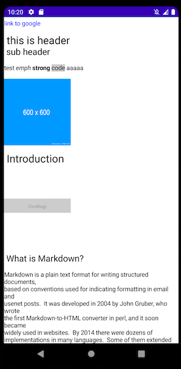

# Display Markdown with Jetpack Compose

This is a sample to display Markdown with Jetpack Compose. Markdown grammar cannot be covered.

## How does this parse Markdown?
I am using this library.

https://github.com/valich/intellij-markdown

## How to display Markdown with Jetpack Compose?

Jetpack Compose's `AnnotatedString` is very flexible in displaying characters.

You can also specify `inlineContent` for Jetpack Compose Text, which allows you to display images.

Also, by using `Modifier.tapGestureFilter` , the position of the tapped character can be obtained, so it is possible to transition when the link is tapped.

